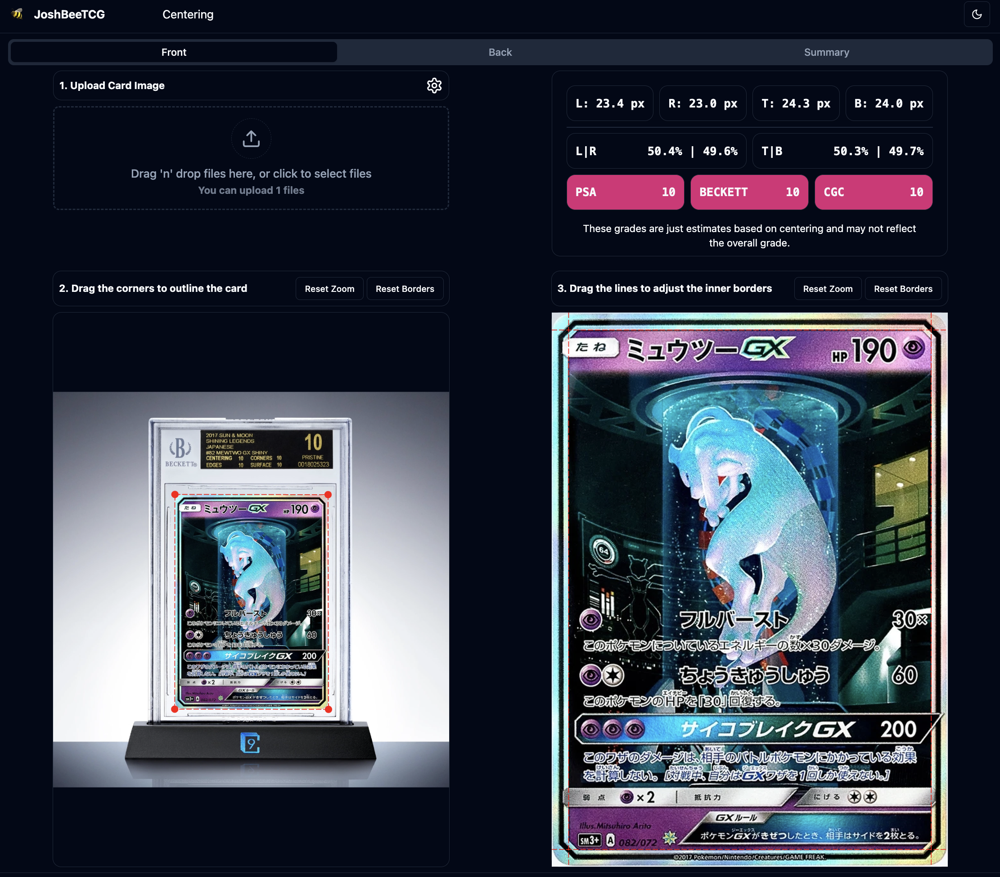

# Benchmarks and Examples

## Pokemon | Standard Card

## Pokemon | VMAX
:::tip[Card Alignment]
- Top border align with the energy symbol.
- Left and right borders use the bottom half of the card where the borders are being faded.
:::

## Pokemon | GX
:::tip[Card Alignment]
- Use the inner silver border and ignore the black border.
:::

## Pokemon | GX | Tag Team

:::tip[Card Alignment]
- Use the inner silver border the same as a standard GX card.  
- Ignore the yellow tag team borders.
:::

